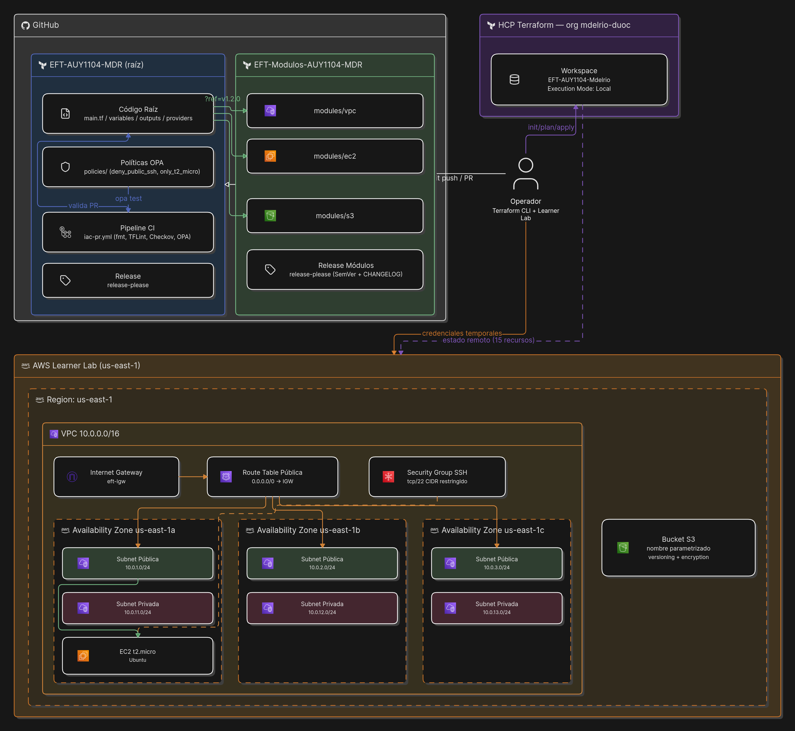
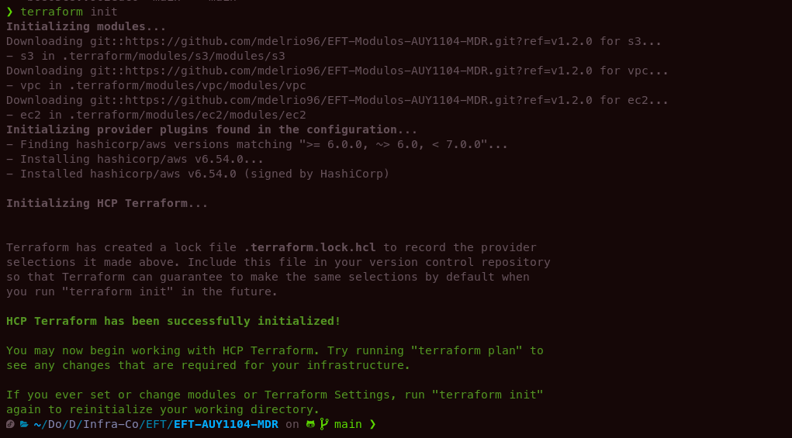
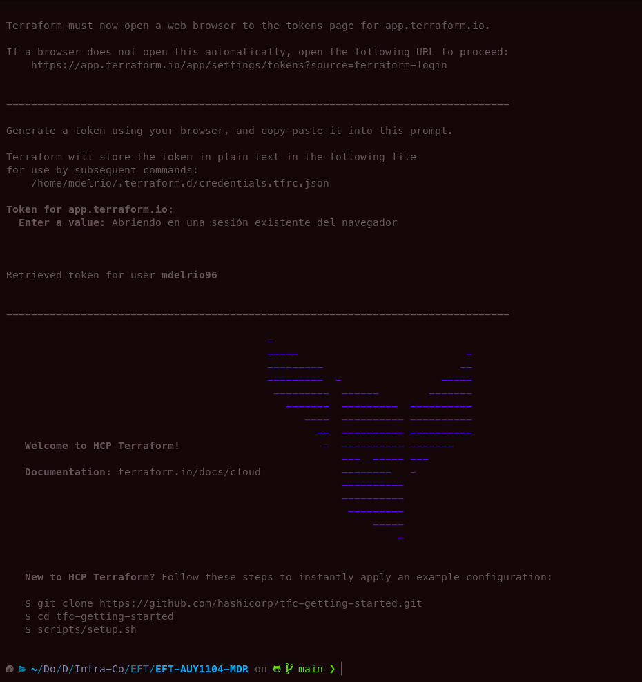
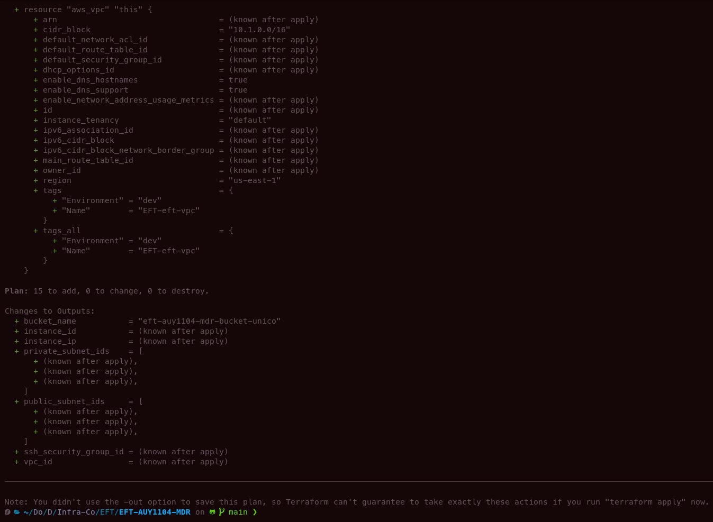
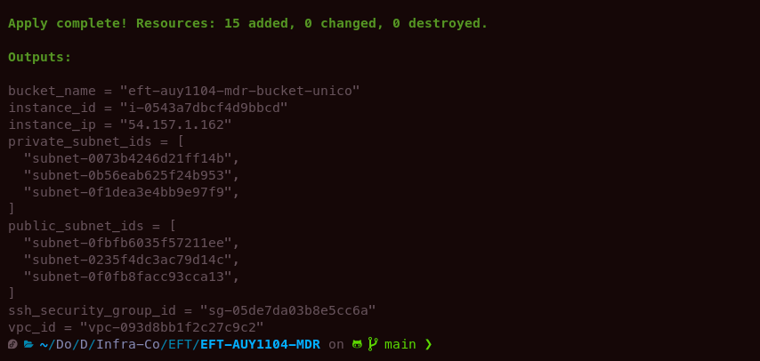
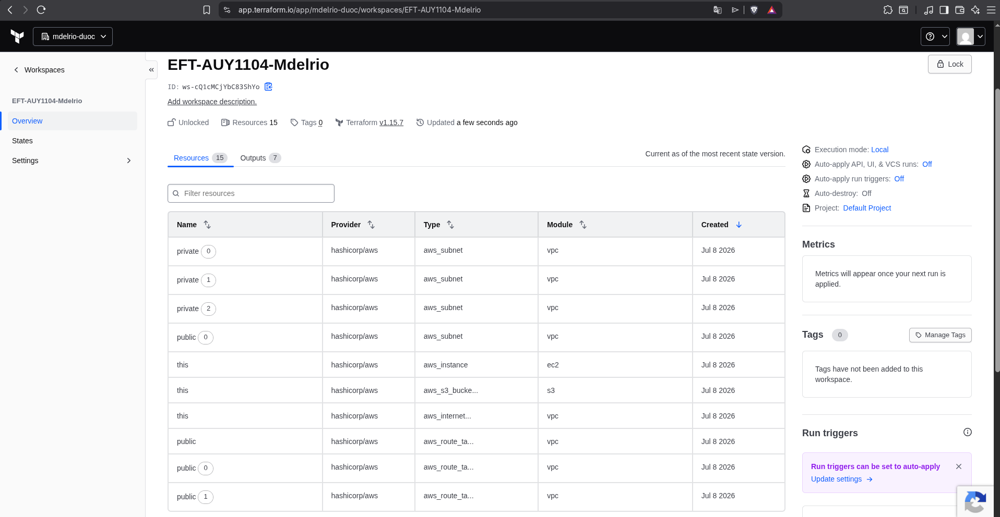
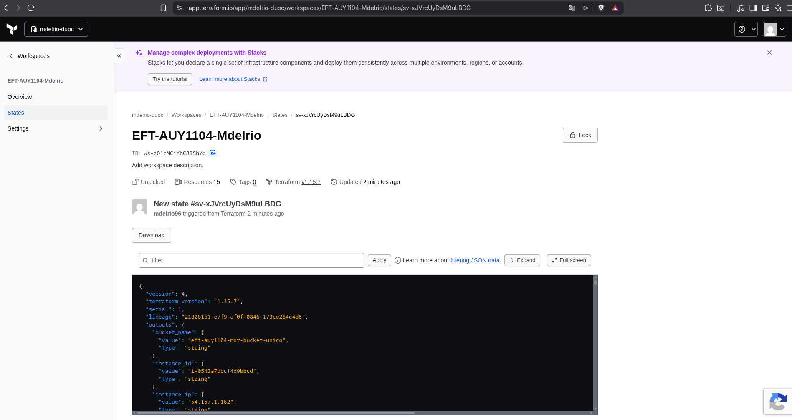
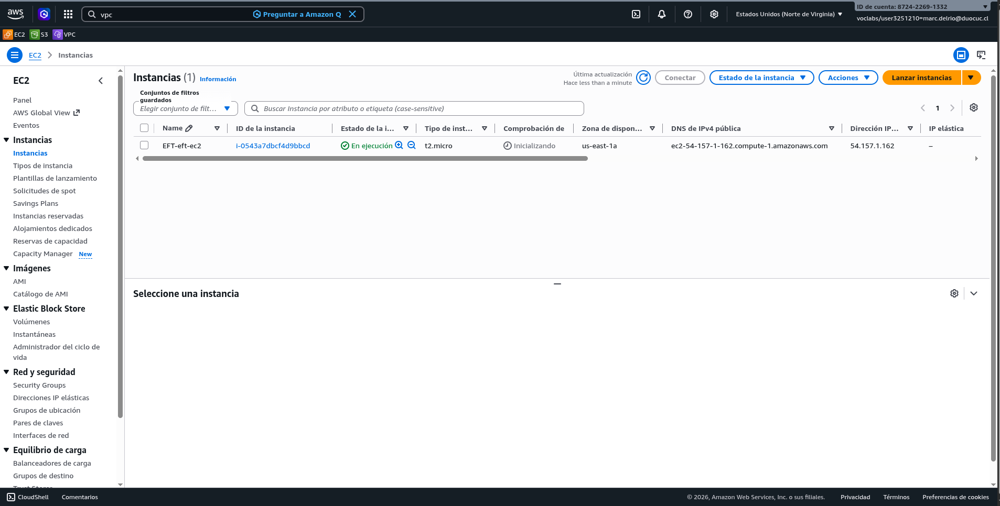
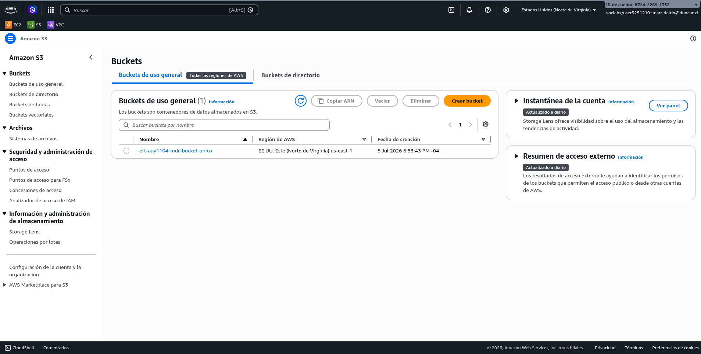
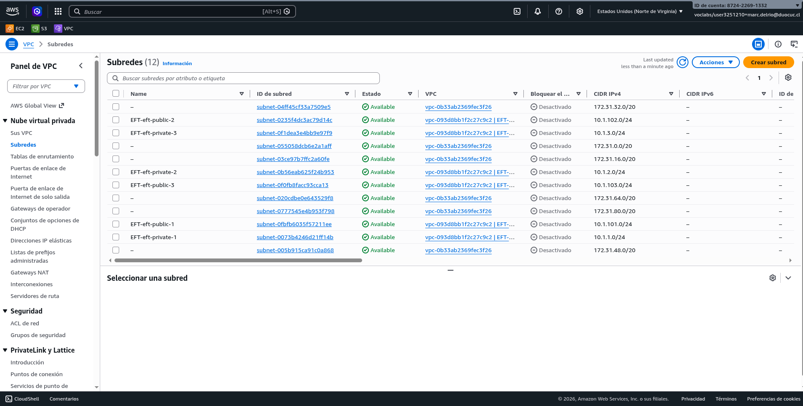

# EFT-AUY1104-MDR

Examen Final Transversal — AUY1105 Infraestructura como Código II (Duoc UC). Consolidado de las Evaluaciones Parciales 1, 2 y 3.

---

## Introducción

El presente informe consolida el trabajo desarrollado durante el semestre en la asignatura Infraestructura como Código II, cuyo hilo conductor fue el diseño, la implementación y la operación de una solución de infraestructura en la nube de AWS utilizando Terraform, con su despliegue automatizado mediante un pipeline de integración continua.

El desarrollo se abordó en tres etapas incrementales. En la primera (Evaluación Parcial 1) se construyó la base de la infraestructura como código, incorporando desde el inicio controles de calidad y seguridad automatizados sobre cada Pull Request. En la segunda (Evaluación Parcial 2) el código se refactorizó y desacopló en módulos reutilizables de Terraform, con documentación, ejemplos y versionado semántico automatizado. En la tercera (Evaluación Parcial 3) se ejercitó la gestión avanzada del estado de Terraform frente a problemáticas reales de operación: pérdida del archivo de estado, desincronización por cambios manuales (*drift*) y exclusión de recursos de la administración de Terraform sin destruirlos.

El resultado es una solución que no solo despliega infraestructura, sino que incorpora las prácticas que hacen sostenible su evolución: modularidad, trazabilidad de cambios, validación continua y capacidad de recuperación ante incidentes de estado.

## Alcance

### Objetivos

- Diseñar e implementar una infraestructura base en AWS (red, cómputo y almacenamiento) definida íntegramente como código con Terraform.
- Desacoplar la infraestructura en módulos reutilizables, documentados y versionados semánticamente, publicados en repositorios GitHub independientes.
- Automatizar la validación de calidad y seguridad del código mediante un pipeline de CI ejecutado en cada Pull Request.
- Demostrar la operación y el mantenimiento de la infraestructura mediante comandos avanzados de Terraform CLI para la gestión del estado.

### Recursos necesarios

- AWS Academy Learner Lab (región `us-east-1`), con las restricciones propias del entorno (tipos de instancia acotados, rol `LabRole` precreado).
- Terraform CLI `>= 1.5.0`, AWS CLI, Git y GitHub (organización de curso `AUY1105-II`).
- Herramientas de calidad: TFLint, Checkov, OPA (Open Policy Agent) y GitHub Actions.
- Automatización de releases: release-please con Conventional Commits.

### Criterios de éxito

- `terraform plan` y `terraform apply` ejecutan sin errores y generan la infraestructura declarada (15 recursos).
- El pipeline de CI aprueba formato, lint, análisis de seguridad estático, validación sintáctica y políticas OPA en cada Pull Request.
- Los módulos son consumibles desde el repositorio raíz mediante referencia Git con tag de versión semántica (`?ref=v1.2.0`).
- Los tres escenarios de gestión de estado finalizan con `No changes. Your infrastructure matches the configuration`, evidenciando sincronización total entre código, estado e infraestructura real, sin pérdida de recursos.

## Diseño de la Solución

### Componentes clave

La solución se organiza en dos repositorios principales:

| Repositorio | Rol |
|---|---|
| `EFT-AUY1104-MDR` (raíz) | Módulo raíz que orquesta la infraestructura completa: invoca los módulos, define variables de alto nivel, expone outputs y aloja el pipeline de CI y las políticas OPA. |
| `EFT-Modulos-AUY1104-MDR` | Repositorio de módulos reutilizables: `vpc`, `ec2` y `s3`, cada uno con `main.tf`, `variables.tf`, `outputs.tf`, `versions.tf` y `README.md` con ejemplos de uso y documentación de variables y outputs. |

**Módulo de redes (`vpc`):** VPC con 3 subnets públicas y 3 privadas en distintas AZ, Internet Gateway, tabla de rutas pública con sus asociaciones y Security Group SSH restringido a un CIDR autorizado. Outputs: `vpc_id`, `subnet_ids`.

**Módulo de cómputo (`ec2`):** instancia EC2 `t2.micro` (Ubuntu) en la primera subnet pública, asociada al Security Group de la capa de red. Outputs: `instance_id`, `instance_ip`.

**Módulo de almacenamiento (`s3`):** bucket S3 con nombre parametrizado globalmente único. Output: nombre del bucket.

### Interacciones

El módulo raíz consume los módulos publicados en [EFT-Modulos-AUY1104-MDR](https://github.com/mdelrio96/EFT-Modulos-AUY1104-MDR) mediante *Git source* apuntando al repositorio de módulos con tag de versión semántica (`?ref=v1.2.0`). El módulo `ec2` depende de los outputs del módulo `vpc` (subnet pública y Security Group), lo que establece el grafo de dependencias que Terraform resuelve en el plan. Las variables sensibles o específicas del entorno (`my_ip`, `bucket_name`) se inyectan por `terraform.tfvars`, excluido del control de versiones mediante `.gitignore`, con una plantilla segura `terraform.tfvars.example` versionada en su lugar.

### Gestión remota del estado (HCP Terraform)

El módulo raíz incorpora un bloque `cloud` que delega el almacenamiento del estado en HCP Terraform:

- **Organización:** `mdelrio-duoc`
- **Workspace:** `EFT-AUY1104-Mdelrio`

Con ello, el archivo de estado deja de residir en el equipo local: queda centralizado, versionado y protegido con bloqueo automático ante operaciones concurrentes, lo que elimina el riesgo de pérdida del `terraform.tfstate` abordado en el primer escenario del Parcial 3. El workspace opera en **modo de ejecución Local**: los `plan`/`apply` se ejecutan en la máquina del operador con las credenciales temporales del Learner Lab, y solo el estado se almacena y versiona en HCP Terraform. Requiere autenticación previa con `terraform login`.

#### Uso

```bash
terraform login          # autenticación con HCP Terraform (una vez)
cp terraform.tfvars.example terraform.tfvars   # completar my_ip y bucket_name
terraform init
terraform plan
terraform apply
```

### Pipeline de calidad (CI/CD)

El workflow `iac-pr.yml` se ejecuta en cada Pull Request hacia `main` con las siguientes etapas secuenciales:

1. `terraform fmt -check -recursive` — verificación de formato canónico.
2. `terraform init -backend=false` — inicialización sin backend para validación.
3. **TFLint** — lint específico de Terraform y del provider AWS.
4. **Checkov** — análisis estático de seguridad, con supresiones de falsos positivos documentadas en el propio workflow.
5. `terraform validate` — validación sintáctica y de coherencia interna.
6. **OPA** (`opa test policies/`) — pruebas de políticas como código.

Las políticas OPA implementadas expresan reglas de seguridad y estandarización del laboratorio:

- `deny_public_ssh.rego`: prohíbe exponer SSH (puerto 22) a `0.0.0.0/0`.
- `only_t2_micro.rego`: restringe el tipo de instancia EC2 a `t2.micro`.
- `policy_test.rego`: pruebas unitarias de ambas políticas.

### Versionado semántico

Los releases del repositorio raíz y de los módulos se gestionan automáticamente con release-please a partir de Conventional Commits: `feat:` incrementa MINOR, `fix:` incrementa PATCH y `feat!:`/`BREAKING CHANGE` incrementan MAJOR; los commits `chore:`, `docs:` y `refactor:` no generan release. El `CHANGELOG.md` y los tags de GitHub se generan de forma automática, garantizando trazabilidad entre cada versión publicada y los commits que la originaron, y minimizando el riesgo de rupturas de compatibilidad para los consumidores de los módulos.

### Gestión avanzada del estado (operación)

Sobre la infraestructura desplegada se resolvieron tres escenarios operativos:

1. **Recuperación del estado perdido:** ante la eliminación de `terraform.tfstate`, se reconstruyó el estado completo con `terraform import` recurso por recurso (15 recursos), obteniendo los identificadores reales desde AWS CLI, hasta lograr un plan sin cambios. Se documentó la particularidad del error `Invalid count argument` al importar la VPC antes que las subnets, resuelto reordenando las importaciones.
2. **Sincronización de drift y reforzamiento:** se provocó un cambio manual en el Security Group (regla TCP 80), detectado por `terraform plan`; se distinguió el efecto de `terraform apply -refresh-only` (sincroniza estado ↔ realidad) frente al `apply` normal (reconcilia hacia la configuración declarada). Se recreó la instancia EC2 con `terraform taint`/`apply` y se demostró la reversión de la marca con `untaint`.
3. **Exclusión de un recurso del estado:** con `terraform state rm` se retiró el Security Group de la administración de Terraform sin destruirlo en AWS, ajustando la configuración (bloque comentado en el módulo y referencia externa mediante variable `ssh_security_group_id`) hasta validar `No changes` en el plan final.

### Seguridad

`terraform.tfvars` está excluido del control de versiones (`.gitignore`); se versiona únicamente la plantilla `terraform.tfvars.example` sin valores reales.

## Diagrama de la Arquitectura

El siguiente diagrama representa la relación entre los repositorios de GitHub, HCP Terraform, el operador y los recursos desplegados en AWS Learner Lab:



## Evidencia de Despliegue

La infraestructura fue desplegada de forma exitosa en AWS Academy Learner Lab (`us-east-1`), con el estado gestionado en el workspace remoto de HCP Terraform.

### `terraform init`

La inicialización descargó los tres módulos desde `EFT-Modulos-AUY1104-MDR` en su versión publicada (`?ref=v1.2.0`), instaló el provider `hashicorp/aws` (`v6.54.0`, dentro del rango `>= 6.0.0, ~> 6.0, < 7.0.0`) y conectó exitosamente con HCP Terraform:

```
Initializing modules...
Downloading git::https://github.com/mdelrio96/EFT-Modulos-AUY1104-MDR.git?ref=v1.2.0 for s3...
Downloading git::https://github.com/mdelrio96/EFT-Modulos-AUY1104-MDR.git?ref=v1.2.0 for vpc...
Downloading git::https://github.com/mdelrio96/EFT-Modulos-AUY1104-MDR.git?ref=v1.2.0 for ec2...

Initializing HCP Terraform...
Terraform has created a lock file .terraform.lock.hcl...

HCP Terraform has been successfully initialized!
```



La autenticación (`terraform login`) generó y almacenó el token de API contra `app.terraform.io`, confirmando el usuario `mdelrio96`.



### `terraform plan`

El plan proyectó la creación completa de la infraestructura sin cambios ni destrucciones:

```
Plan: 15 to add, 0 to change, 0 to destroy.

Changes to Outputs:
  + bucket_name          = "eft-auy1104-mdr-bucket-unico"
  + instance_id          = (known after apply)
  + instance_ip          = (known after apply)
  + private_subnet_ids   = [(known after apply) x3]
  + public_subnet_ids    = [(known after apply) x3]
  + ssh_security_group_id = (known after apply)
  + vpc_id                = (known after apply)
```



### `terraform apply`

```
Apply complete! Resources: 15 added, 0 changed, 0 destroyed.

Outputs:

bucket_name = "eft-auy1104-mdr-bucket-unico"
instance_id = "i-0543a7dbcf4d9bbcd"
instance_ip = "54.157.1.162"
private_subnet_ids = [
  "subnet-0073b4246d21ff14b",
  "subnet-0b56eab625f24b953",
  "subnet-0f1dea3e4bb9e97f9",
]
public_subnet_ids = [
  "subnet-0fbfb6035f57211ee",
  "subnet-0235f4dc3ac79d14c",
  "subnet-0f0fb8facc93cca13",
]
ssh_security_group_id = "sg-05de7da03b8e5cc6a"
vpc_id = "vpc-093d8bb1f2c27c9c2"
```



### Verificación en HCP Terraform

El workspace `EFT-AUY1104-Mdelrio` (organización `mdelrio-duoc`) confirma el estado sincronizado:

- **Execution mode:** Local.
- **Resources:** 15, distribuidos en los módulos `vpc` (subnets públicas/privadas, Internet Gateway, tabla de rutas, Security Group), `ec2` (instancia) y `s3` (bucket).
- **Terraform version:** `v1.15.7`.
- Nueva versión de estado (`New state`) registrada tras el `apply`, disparada por el usuario `mdelrio96` desde Terraform CLI.




### Verificación en la consola de AWS

- **EC2:** instancia `EFT-eft-ec2` (`i-0543a7dbcf4d9bbcd`), tipo `t2.micro`, en ejecución en `us-east-1a`, con IP pública `54.157.1.162`, coincidente con el output `instance_ip`.
- **S3:** bucket `eft-auy1104-mdr-bucket-unico` visible en la región `us-east-1`, coincidente con el output `bucket_name`.
- **VPC:** las 6 subnets propias del despliegue (`EFT-eft-public-1/2/3` y `EFT-eft-private-1/2/3`, CIDR `10.1.0.0/16`) visibles junto a las subnets `172.31.0.0/16` por defecto del Learner Lab, confirmando que la solución no interfiere con recursos preexistentes del entorno.





## Conclusiones

La solución desarrollada aborda de forma integral los desafíos planteados en las tres evaluaciones parciales. La modularización (Parcial 2) transformó un código monolítico (Parcial 1) en componentes reutilizables e integrables en distintos entornos, con contratos claros de variables y outputs. La documentación por módulo, con ejemplos de uso y changelogs generados automáticamente, reduce la barrera de adopción y cumple los requisitos de mantenibilidad exigidos.

El pipeline de calidad garantiza que ningún cambio llegue a `main` sin pasar validación de formato, lint, seguridad estática y políticas organizacionales expresadas como código, lo que materializa el enfoque DevSecOps sobre la infraestructura. El versionado semántico automatizado protege a los consumidores de los módulos frente a rupturas de compatibilidad.

Finalmente, los escenarios de gestión de estado (Parcial 3) demostraron que la infraestructura es operable y recuperable ante incidentes reales — pérdida de estado, drift por cambios manuales y transferencia de recursos fuera de la gestión de Terraform — sin pérdida de datos ni interrupciones, validando la integridad del ciclo de vida completo de la solución.

## Anexos

- **GitHub Repository (raíz):** https://github.com/mdelrio96/EFT-AUY1104-MDR
- **GitHub Repository (módulos):** https://github.com/mdelrio96/EFT-Modulos-AUY1104-MDR
- **Terraform (HCP Terraform):** organización `mdelrio-duoc`, workspace `EFT-AUY1104-Mdelrio` — https://app.terraform.io/app/mdelrio-duoc/workspaces/EFT-AUY1104-Mdelrio
